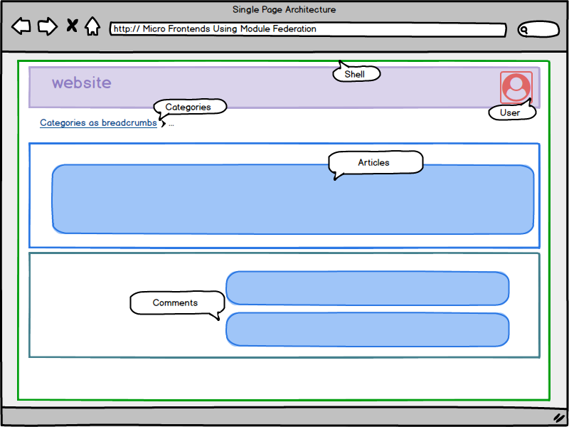

# mfe-blog

starting point

ng new mfe-blog-example --create-application false --minimal

cd mfe-blog-example

ng g application shell --routing --style css --inline-style

ng g c articles --project shell